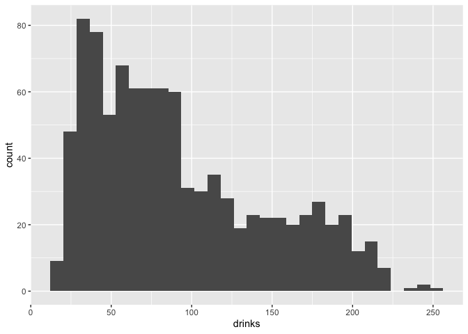
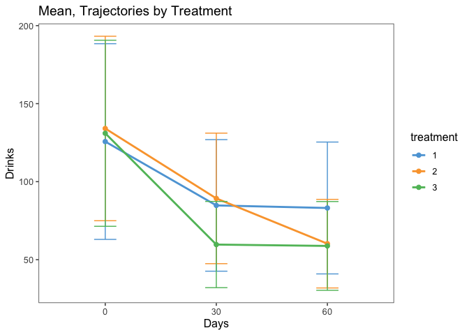
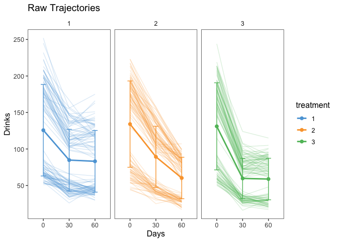
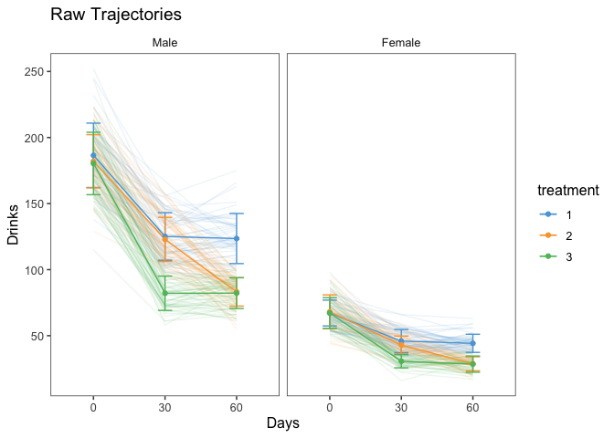

Exploratory Data Analysis
================
Laura Cosgrove
11/27/2019

``` r
library(tidyverse)
```

    ## ── Attaching packages ───────────────────────────────────────────────────────────── tidyverse 1.2.1 ──

    ## ✔ ggplot2 3.2.1     ✔ purrr   0.3.2
    ## ✔ tibble  2.1.3     ✔ dplyr   0.8.3
    ## ✔ tidyr   1.0.0     ✔ stringr 1.4.0
    ## ✔ readr   1.3.1     ✔ forcats 0.4.0

    ## ── Conflicts ──────────────────────────────────────────────────────────────── tidyverse_conflicts() ──
    ## ✖ dplyr::filter() masks stats::filter()
    ## ✖ dplyr::lag()    masks stats::lag()

# Read data

``` r
alc_dat <- readxl::read_xls("./data/ALCDEP.xls")

alc_dat <- janitor::clean_names(alc_dat) %>% 
  mutate(treatment = factor(treatment)) %>% 
  mutate(gender = factor(gender, levels = c(0,1), labels = c("Male", "Female")))

alc_dat_long <- alc_dat %>% 
  pivot_longer(nd0:nd60, names_to = "days", values_to = "drinks", names_prefix = "nd")
```

# Explore outcome distribution

``` r
summary(alc_dat_long$drinks)
```

    ##    Min. 1st Qu.  Median    Mean 3rd Qu.    Max. 
    ##   16.00   47.00   79.00   92.01  127.00  252.00

``` r
var(alc_dat_long$drinks) #overdispersion if poisson
```

    ## [1] 2916.022

``` r
alc_dat_long %>% 
  group_by(gender, days, treatment) %>% 
  summarize(mean = mean(drinks),
            var = var(drinks),
            scale = var/mean)  %>% 
  knitr::kable() 
```

| gender | days | treatment |      mean |       var |     scale |
| :----- | :--- | :-------- | --------: | --------: | --------: |
| Male   | 0    | 1         | 186.51923 | 593.98002 | 3.1845511 |
| Male   | 0    | 2         | 182.00000 | 405.24590 | 2.2266258 |
| Male   | 0    | 3         | 180.35088 | 558.08897 | 3.0944622 |
| Male   | 30   | 1         | 125.11538 | 324.02564 | 2.5898145 |
| Male   | 30   | 2         | 122.87097 | 279.29455 | 2.2730720 |
| Male   | 30   | 3         |  82.12281 | 168.64536 | 2.0535752 |
| Male   | 60   | 1         | 123.53846 | 359.62594 | 2.9110444 |
| Male   | 60   | 2         |  83.14516 | 115.14252 | 1.3848373 |
| Male   | 60   | 3         |  82.22807 | 135.89348 | 1.6526410 |
| Female | 0    | 1         |  67.14815 |  95.63802 | 1.4242837 |
| Female | 0    | 2         |  68.06667 | 164.38182 | 2.4150120 |
| Female | 0    | 3         |  67.11364 | 136.01004 | 2.0265634 |
| Female | 30   | 1         |  45.94444 |  76.99686 | 1.6758687 |
| Female | 30   | 2         |  42.97778 |  45.88586 | 1.0676648 |
| Female | 30   | 3         |  30.63636 |  24.65539 | 0.8047754 |
| Female | 60   | 1         |  44.22222 |  47.04403 | 1.0638096 |
| Female | 60   | 2         |  28.73333 |  28.06364 | 0.9766927 |
| Female | 60   | 3         |  28.47727 |  37.65063 | 1.3221292 |

``` r
#still some overdispersion if poisson in the gender x treatment x time model; maybe need negative binomial model, maybe not

#normal approximation?
alc_dat_long %>% 
  ggplot(aes(x = drinks)) + geom_histogram() #clearly not a normal distribution, clearly poisson
```

    ## `stat_bin()` using `bins = 30`. Pick better value with `binwidth`.

<!-- -->

Choose a poisson-distributed and negative-binomial distributed outcome
and check diagnostics for overdispersion.

# Exploratory Mean and Trajectory Plots

``` r
alc_dat_long %>% 
  group_by(treatment, days) %>% 
  summarize(mean_drinks = mean(drinks),
            upper = mean_drinks + sd(drinks),
            lower = mean_drinks - sd(drinks)) %>% 
  ggplot(aes(x = days, color = treatment)) +
  geom_line(aes(y = mean_drinks, group = treatment), size = 1) + 
  geom_errorbar(aes(ymin = lower, ymax = upper, group = treatment), width = 0.2) + 
  geom_point(aes(y = mean_drinks), size = 2) +
  ggthemes::theme_few() + ggthemes::scale_color_few()+ labs(title = "Mean, Trajectories by Treatment", y = "Drinks", x = "Days")
```

<!-- -->

``` r
alc_dat_long %>% 
  group_by(treatment, days) %>% 
  summarize(mean_drinks = mean(drinks),
            upper = mean_drinks + sd(drinks),
            lower = mean_drinks - sd(drinks)) %>% 
  ggplot(aes(x = days, color = treatment)) +
  geom_line(aes(y = mean_drinks, group = treatment), size = 1) + 
  geom_errorbar(aes(ymin = lower, ymax = upper, group = treatment), width = 0.2) + 
  geom_point(aes(y = mean_drinks), size = 2) +
  geom_line(data = alc_dat_long, aes(x = days, y = drinks, group = sid), alpha = 0.2) + 
  ggthemes::theme_few() + ggthemes::scale_color_few() + facet_grid(~treatment) + labs(title = "Raw Trajectories", y = "Drinks", x = "Days")
```

<!-- -->

There are clearly two groups of patients in all groups, with a wide
berth between the groups: those whose baseline number of alcoholic
drinks in the past 30 days is less than 100 (~3 drinks/day) and those
who are closer to 150 in the past 30 days (5 drinks a day).

Perhaps this could be a gender effect:

``` r
alc_dat_long %>% 
  group_by(treatment, days, gender) %>% 
  summarize(mean_drinks = mean(drinks),
            upper = mean_drinks + sd(drinks),
            lower = mean_drinks - sd(drinks)) %>% 
  ggplot(aes(x = days, color = treatment)) +
  geom_line(data = alc_dat_long, aes(x = days, y = drinks, group = sid), alpha = 0.1) +
  geom_line(aes(y = mean_drinks, group = treatment)) + 
  geom_errorbar(aes(ymin = lower, ymax = upper, group = treatment), width = 0.2) + 
  geom_point(aes(y = mean_drinks)) +
  ggthemes::theme_few() + ggthemes::scale_color_few() + facet_grid(~gender) + labs(title = "Raw Trajectories", y = "Drinks", x = "Days")
```

<!-- -->

It is, in fact, a gender effect, and variance shrinks a great deal when
the outcome is stratified on gender. Luckily, there does not seem to be
heterogeneity of treatment effect by gender; the treatment trajectories
look the same, but scaled to the respectice within-gender mean.

Now, lets’s look at faceting on relapsers vs. no relapsers:

``` r
library(janitor)
```

    ## 
    ## Attaching package: 'janitor'

    ## The following objects are masked from 'package:stats':
    ## 
    ##     chisq.test, fisher.test

``` r
alc_dat_long %>% 
  tabyl(treatment, relapse) %>% 
  adorn_percentages("row") %>%
  adorn_pct_formatting(digits = 2) %>%
  adorn_ns() %>% 
  knitr::kable(caption = "Contingency table of Relapse by Treatment")
```

| treatment | 0            | 1            |
| :-------- | :----------- | :----------- |
| 1         | 17.92% (57)  | 82.08% (261) |
| 2         | 54.21% (174) | 45.79% (147) |
| 3         | 86.14% (261) | 13.86% (42)  |

Contingency table of Relapse by Treatment

``` r
alc_dat_long %>% 
  tabyl(treatment, relapse) %>% 
  chisq.test()
```

    ## 
    ##  Pearson's Chi-squared test
    ## 
    ## data:  .
    ## X-squared = 290.13, df = 2, p-value < 2.2e-16

``` r
#significant differences. pairwise:

alc_dat_long %>% 
  filter(treatment %in% 1:2) %>% 
  mutate(treatment = forcats::fct_drop(treatment)) %>% 
  tabyl(treatment, relapse) %>% 
  chisq.test(.)
```

    ## 
    ##  Pearson's Chi-squared test with Yates' continuity correction
    ## 
    ## data:  .
    ## X-squared = 89.536, df = 1, p-value < 2.2e-16

``` r
alc_dat_long %>% 
  filter(treatment %in% 1:3) %>% 
  mutate(treatment = forcats::fct_drop(treatment)) %>% 
  tabyl(treatment, relapse) %>% 
  chisq.test(.)
```

    ## 
    ##  Pearson's Chi-squared test
    ## 
    ## data:  .
    ## X-squared = 290.13, df = 2, p-value < 2.2e-16

``` r
alc_dat_long %>% 
  filter(treatment %in% 2:3) %>% 
  mutate(treatment = forcats::fct_drop(treatment)) %>% 
  tabyl(treatment, relapse) %>% 
  chisq.test(.)
```

    ## 
    ##  Pearson's Chi-squared test with Yates' continuity correction
    ## 
    ## data:  .
    ## X-squared = 73.772, df = 1, p-value < 2.2e-16

``` r
#all pairwise differences are highly significant
```

# Questions

We can guess at the answers to a few of the researcher’s questions:

  - Is there evidence to suggest that the treatments differ in their
    effects on alcohol dependence, as reflected by the number of drinks
    consumed in a given 30 day period?

Based on looking at the plots, it seems that at the end of the study,
treatments 2 and 3 have the same rate reduction in drinks among the
gender strata while treatment 1 has a smaller rate reduction.

  - Is there a difference in the pattern of change in the number of
    drinks consumed between the various treatment groups over the
    duration of the study?

Based on looking at the plots, it seems that treatments 1 and 2 have a
period of faster decline between baseline and 30 days and no rate
reduction in drinks from 30 to 60 days.

  - Alcohol-use disorders are among the most disabling disease
    categories for the global burden of disease especially for men. Is
    there evidence to suggest that males tend to have a higher alcohol
    dependence than females?

Yes, there is clear evidence to suggest this.

  - Do men and women respond differently to treatment ?

No, based on looking at the plots, treatment trajectories seem to be the
same.

  - Is there any evidence to suggest that the treatments differ in their
    effects on subjects with regard to relapsing into alcohol dependence
    ?

Exploratory data analysis and an overall chi-squared test suggests that
treatments differ in their effects on subjects with regard to relapsing
into alcohol dependence. After pairwise tests, we find that all pairwise
differences are highly significant. So, treatments 1 and 2 significantly
differ in the distributions of relapsers, and treatment 2 had fewer
relapsers than treatment 1; and treatments 2 and 3 significantly differ
in the distributions of relapsers, and treatment 3 had fewer relapsers
than treatment 2.

  - Even in the case that the treatments might differ in their pattern
    of change or on how subjects relapse into alcohol dependence, is
    there any evidence to suggest that any of the treatments might be
    beneficial once the treatment has stopped.

No data were observed after the treatment was stopped, so such a claim
would be extrapolation and has no support in the data.
